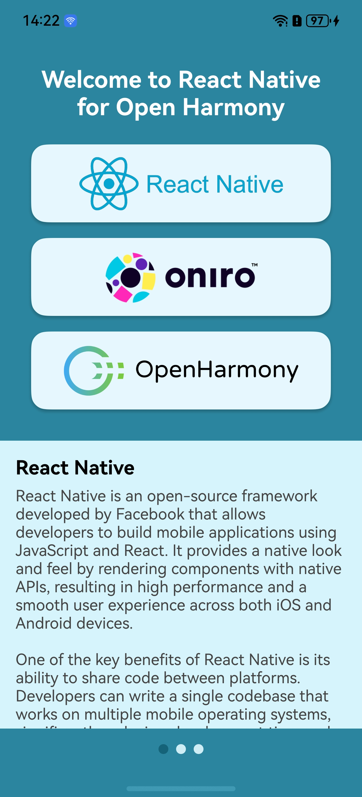

# app-rnoh-example

Example React Native application for Oniro/OpenHarmony.

The aim of this project is to create a template for new React Native applications for Open Harmony, as well as to present the fundamentals of building cross-platform applications in React Native.

The code is divided into two directories:

- **oh-app**: OpenHarmony application template serving as a container for the React Native app.
- **rnoh-app**: The actual React Native app embedded in the OH app.

<table>
    <tr>
        <td rowspan="2">
            
        </td>
        <th>Functionalities of the Application</th>
    </tr>
    <tr>
        <td>
            <ul>
                <li><strong>Animation</strong>: Sliding animation for the logo container using <code>Animated</code> API and <code>useRef</code>.</li>
                <li><strong>Button Interaction</strong>: Handling logo press events with the <code>LogoBox</code> component and <code>onPress</code> prop.</li>
                <li><strong>useEffect Hook</strong>: Triggering animations on component mount.</li>
                <li><strong>Reusable Components</strong>: Creating and styling <code>LogoBox</code> for logos.</li>
                <li><strong>Screen Carousel</strong>: Using <code>ScrollView</code> to navigate between screens (<code>Screen1</code>, <code>Screen2</code>, <code>Screen3</code>).</li>
                <li><strong>Dynamic Switching</strong>: Scrolling carousel based on logo press.</li>
                <li><strong>Code Structure</strong>: Modular organization with components and screens.</li>
                <li><strong>Responsiveness</strong>: Adjusting screen width dynamically with <code>Dimensions</code>.</li>
            </ul>
            <p>The app demonstrates React Native features for building interactive and animated UIs.</p>
        </td>
    </tr>
</table>

## A quick how-to

1. The code of the sample application has already been prepared and adapted for compilation with RN, it can serve as a template for other apps.

More details:
https://gitee.com/openharmony-sig/ohos_react_native/blob/0.72.5-ohos-5.0-release/docs/en/environment-setup.md

2. Create a JS bundle with RN app: 
```
$ cd rnoh-app
$ npm run dev
```
3. Copy generated budle to the OH app:

Copy the entire contents of the directory:
```
rnoh-app/harmony/entry/src/main/resources/rawfile
``` 
to the directory:
```
oh-app/entry/src/main/src/main/resources/rawfile
```
4. Compile the **oh-app** with the DevEco.


## Detailed instructions

1. [Prerequisites](doc/prerequisites.md)
2. [Development environment configuration](doc/development-environment-configuration.md)
3. [Preparation of React Native application code](doc/react-native-application-code.md)
4. [Preparation of the Open Harmony application code](doc/open-harmony-application-code.md)
5. [Compilation of the app](doc/compilation.md)
6. [Deployment](doc/deployment.md)
7. [Troubleshooting](doc/troubleshooting.md)

