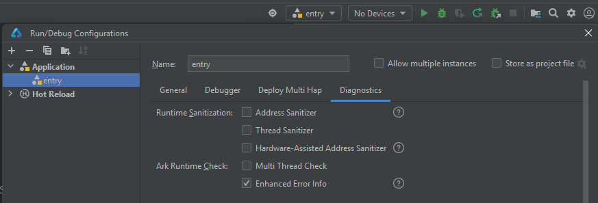

# Troubleshooting

Application should compile and run without issues on the **HarmonyNEXT** system.
However, when using the current **RNOH** version **0.72** in **Open Harmony**, problems may occur.

The application was running on the [HiHope HH-SCDAYU200](https://docs.oniroproject.org/developer-boards/hihope-hh-scdayu200.html) development board with **OpenHarmony 5.0**.

## Issues:

After resolving the issues below, the project compiled and ran correctly:

1. [Filename longer than 260 characters](#1-filename-longer-than-260-characters)
2. [Couldn't create bindings between ETS and CPP](#2-couldnt-create-bindings-between-ets-and-cpp)
3. [Kit '@kit.ShareKit' has no corresponding config file in ArkTS SDK](#3-kit-kitsharekit-has-no-corresponding-config-file-in-arkts-sdk)
4. [Error loading shared library librawfile.z.so](#4-error-loading-shared-library-librawfilezso)
5. [Register type windowRectChange failed](#5-register-type-windowrectchange-failed)

## 1. Filename longer than 260 characters

Compilation of the project by **DevEco** ends with the following error:

```shell
> hvigor WARN: ninja: error: Stat(rn/patches/react_native_core/react/renderer/textlayoutmanager/CMakeFiles/react_render_textlayoutmanager.dir/C_/Projects/MyReactNativeApp/oh_modules/@rnoh/react-native-openharmony/src/main/cpp/third-party/rn/ReactCommon/react/renderer/textlayoutmanager/TextMeasureCache.cpp.o): Filename longer than 260 characters

> hvigor ERROR: Failed :entry:default@BuildNativeWithNinja... 
> hvigor ERROR: Exceptions happened while executing: ninja: Entering directory `C:\Projects\MyReactNativeApp\entry\.cxx\default\default\debug\arm64-v8a'
[0/2] Re-checking globbed directories...
ninja: error: Stat(rn/patches/react_native_core/react/renderer/textlayoutmanager/CMakeFiles/react_render_textlayoutmanager.dir/C_/Projects/MyReactNativeApp/oh_modules/@rnoh/react-native-openharmony/src/main/cpp/third-party/rn/ReactCommon/react/renderer/textlayoutmanager/TextMeasureCache.cpp.o): Filename longer than 260 characters

> hvigor ERROR: BUILD FAILED in 2 s 45 ms
```

### Cause:

- The name and path of the compiled file exceed 260 characters. This limitation is imposed by Windows:
 https://learn.microsoft.com/en-us/windows/win32/fileio/maximum-file-path-limitation

- The issue might also be caused by the ninja.exe program:
 https://github.com/ninja-build/ninja/issues/1900

### Solution:

- Make registry changes according to the instructions provided on Microsoft's pages.
- Check if a newer version of the ninja.exe program resolves the issue.
- Move the project directory to the root folder of the hard drive.
- OR: Build the application on macOS or Linux.

## 2. Couldn't create bindings between ETS and CPP

The application compiles but immediately crashes after start:

```javascript
Device info:OpenHarmony 3.2
Build info:OpenHarmony 5.0.0.71
Fingerprint:59107f8d9f3eb72ce161c09a75801513b584c54a4e3cb7a3c25211769024282b
Module name:com.rnoh.tester
Version:1.0.0
VersionCode:1000000
PreInstalled:No
Foreground:Yes
Pid:24187
Uid:20010046
Reason:Error
Error name:Error
Error message:Couldn't create bindings between ETS and CPP. libRNOHApp is undefined.
Stacktrace:
    at RNOHError (react_native_openharmony/src/main/ets/RNOH/RNOHError.ts:35:5)
    at FatalRNOHError (react_native_openharmony/src/main/ets/RNOH/RNOHError.ts:8:10)
    at onInit (react_native_openharmony/src/main/ets/RNOH/NapiBridge.ts:98:19)
    at create (react_native_openharmony/src/main/ets/RNOH/RNInstancesCoordinator.ets:127:7)
    at onCreate (react_native_openharmony/src/main/ets/RNOH/RNAbility.ets:96:35)
```

### Cause:

The ```libRNOHApp``` library actually corresponds to the dynamic library ```librnoh_app.so```, which is the result of compiling C++ as a dynamic library. The error may occur for two reasons:

- ```librnoh_app.so``` does not actually exist.  
- The library is present, but the issue is caused by other factors.

### Solution:

- Check if the ```librnoh_app.so``` file is available, navigate to the root directory of the Harmony project and:

    - Check the folder:  
        ```\entry\build\default\intermediates\libs\default\arm64-v8a\```
        to see if the appropriate .so file is present; 

    - Or check if in the package XXX.hap located in:  
        ```\entry\build\default\outputs\default\```
        the ```libs/arm64-v8a``` directory contains the appropriate .so file.


- Edit the configuration file ```entry/build-profile.json5``` in the ```buildOptions``` section by adding the ```externalNativeOptions``` option:

```json
"buildOption": {
    "externalNativeOptions": {
        "path": "./src/main/cpp/CMakeLists.txt",
        "arguments": "",
        "cppFlags": "",            
    }                
}
```

- Check the **Hilog** to locate the fault. One possible cause is that ```libhermes.so``` is not packed into **YOURAPPNAME.hap**. (The **Hilog** reports ```can't find library libhermes.so in namespace: moduleNs_default```.)

- Alternatively, enable the error enhancement function of IDE, as shown in the following figure:



- Upgrade your IDE to the latest version.

- Add the following information to ```/build-profile.json5``` of the HAR module:

```json
(type=har in modules.json5)
    "nativeLib": { // Same level as apiType
        "excludeFromHar": false
    }
```
- To manually solve the problem, you can also copy the content in the ```oh_modules/@rnoh/react-native-openharmony/src/main/cpp/third-party/prebuilt``` directory of the RN source code to the ```oh_modules/@rnoh/react-native-openharmony/libs``` directory.

- Check if your version of Open Harmony is 64-bit. If not, flash your device with the 64-bit
 OHOS image: https://ci.openharmony.cn/workbench/cicd/dailybuild/dailylist


## 3. Kit '@kit.ShareKit' has no corresponding config file in ArkTS SDK
The project fails to compile as an **OpenHarmony SDK API 12** target. Error message:

```
Kit '@kit.ShareKit' has no corresponding config file in ArkTS SDK
```

### Cause:

This library is missing in the **OpenHarmony SDK API 12**.

### Workaround:

**Temporary solution:** This RN functionality will not work. However, it allows the project to compile on the **OpenHarmony** system. The ultimate solution should remove the dependency on libraries from the **HarmonyNEXT SDK**.

Edit the file ```ShareTurboModule.ts``` located in the directory:

```
.\oh-app\oh_modules\.ohpm\@rnoh+react-native-openharmony@0.72.53\oh_modules\@rnoh\react-native-openharmony\src\main\ets\RNOHCorePackage\turboModules
```
On line 11, comment out:

```typescript
import { RNOHLogger } from '../../RNOH/RNOHLogger';
//import { systemShare } from '@kit.ShareKit';
```

Modify ```share``` method:

```typescript
  async share(
    content: { title?: string; message?: string; url?: string },
    dialogTitle?: string,
  ): Promise<{ action: string }> {
    if (!content) {
        this.logger.error('Content is null');
        return Promise.reject('Content cannot be null');
    }

    return Promise.resolve({ action: ACTION_SHARED });

    // let sharedData: systemShare.SharedData = new systemShare.SharedData(undefined);
    // let sharedRecord: systemShare.SharedData = ...
    // [...]
    // [comment out the rest of the code in this method]
```

Now the project should compile correctly.
You might also try replacing that code to use ```@ohos.app.ability.wantConstant``` from the **OHOS SDK**.

## 4. Error loading shared library librawfile.z.so

Application starts without crashing, but it is a transparent layer with no UI.
The following error appears in the logs:

```
Error message:First attempt: load app module failed. Error loading shared library librawfile.z.so: No such file or directory (needed by /data/storage/el1/bundle/libs/arm64/librnoh_app.so)
Second attempt: load module default/rnoh_app failed. module path is empty
try to load abc file from  failed
Stacktrace:
    at onInit (oh_modules/.ohpm/@rnoh+react-native-openharmony@0.72.53/oh_modules/@rnoh/react-native-openharmony/src/main/ets/RNOH/NapiBridge.ts:97:12)
    at create (oh_modules/.ohpm/@rnoh+react-native-openharmony@0.72.53/oh_modules/@rnoh/react-native-openharmony/src/main/ets/RNOH/RNInstancesCoordinator.ets:125:7)
    at onCreate (oh_modules/.ohpm/@rnoh+react-native-openharmony@0.72.53/oh_modules/@rnoh/react-native-openharmony/src/main/ets/RNOH/RNAbility.ets:96:35)
```

### Cause:

The reason is that the ```librawfile.z.so``` directory is located under ```system/lib64```. On **OHOS**, sandbox controls have been applied, so this directory is not mounted; only ```system/lib64/ndk``` is mounted.

### Solution:

1. Mount your device filesystem:

```shell
$ hdc target mount
```

2. Modify the sandbox file: In ```system/ets/sandbox/appdata-sandbox.json```, search for the keyword ```/system/lib``` and add ```/system/lib64``` at the appropriate positions.

```json
{
    "src-path":"/system/lib64",
    "sandbox-path":"/system/lib64",
    "sandbox-flags":[
        "bind",
        "rec"
    ],
    "check-action-status":"false"
}
```

**Note:** This entry should be added in two places.


## 5. Register type windowRectChange failed

The application starts, the splash screen appears, but does not proceed further. An error appears in the logs:

```
08-05 17:47:27.604   16270-16270   A0beef/#RNOH_ARK                com.examp...loworld5  I     █____  
                                                                                               ██████╗ ███╗   ██╗ ██████╗ ██╗  ██╗
                                                                                               ██╔══██╗████╗  ██║██╔═══██╗██║  ██║
                                                                                               ██████╔╝██╔██╗ ██║██║   ██║███████║
                                                                                               ██╔══██╗██║╚██╗██║██║   ██║██╔══██║
                                                                                               ██║  ██║██║ ╚████║╚██████╔╝██║  ██║
                                                                                               ╚═╝  ╚═╝╚═╝  ╚═══╝ ╚═════╝ ╚═╝  ╚═╝
                                                                                               █____ — MAIN
                                                                                               _█___ — BACKGROUND
                                                                                               __█__ — JS
                                                                                               ___█_ — WORKER
                                                                                               ____█ — CLEANUP
                                                                                               ==================
08-05 17:47:27.609   16270-16270   A0beef/#RNOH_CPP                com.examp...loworld5  I     █____ RNOHAppNapiBridge.cpp:99> onInit (LOG_VERBOSITY_LEVEL=0)
08-05 17:47:27.626   16270-16270   A0beef/#RNOH_CPP                com.examp...loworld5  I     █____ ArkTSBridge.cpp:23> ArkTSBridge::ArkTSBridge
08-05 17:47:27.652   16270-16270   A0beef/#RNOH_ARK                com.examp...loworld5  D     █____ RNAbility::onWindowStageCreate  START
08-05 17:47:27.652   16270-16270   A0beef/#RNOH_ARK                com.examp...loworld5  D     █____ RNAbility::onWindowSetup  START
08-05 17:47:27.673   16270-16270   A0beef/#RNOH_ARK                com.examp...loworld5  E     █____ RNAbility::onWindowSetup  Failed to setup window {"code":801}
```

```RNAbility``` log:

```
08-05 17:47:27.672   16270-16270   C04200/JsRegisterManager        com.examp...loworld5  I     <340>[NAPI]Method windowRectChange has not been registerted
08-05 17:47:27.672   16270-16270   C04200/JsRegisterManager        com.examp...loworld5  E     <385>RegisterListener: [NAPI]Register type windowRectChange failed
```

### Workaround:

**Temporary solution:** comment out in the code in the file ```RNAbility.ets``` (line 150) in the directory:

```
.\oh-app\oh_modules\.ohpm\@rnoh+react-native-openharmony@0.72.53\oh_modules\@rnoh\react-native-openharmony\src\main\ets\RNOH
```

Find this fragment:

```typescript
      mainWindow.on('windowSizeChange', onWindowSizeChange)
      //mainWindow.on('windowRectChange', onWindowReactChange)
      windowStage.on('windowStageEvent', onWindowStageChange)
```
